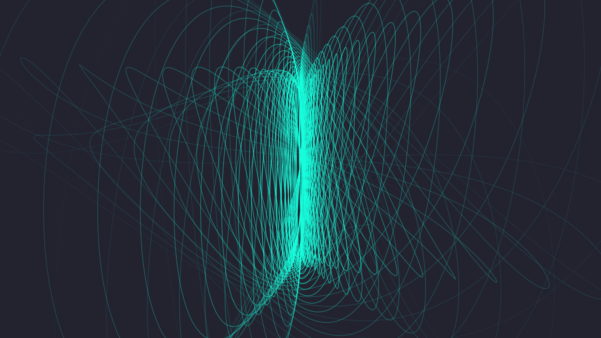
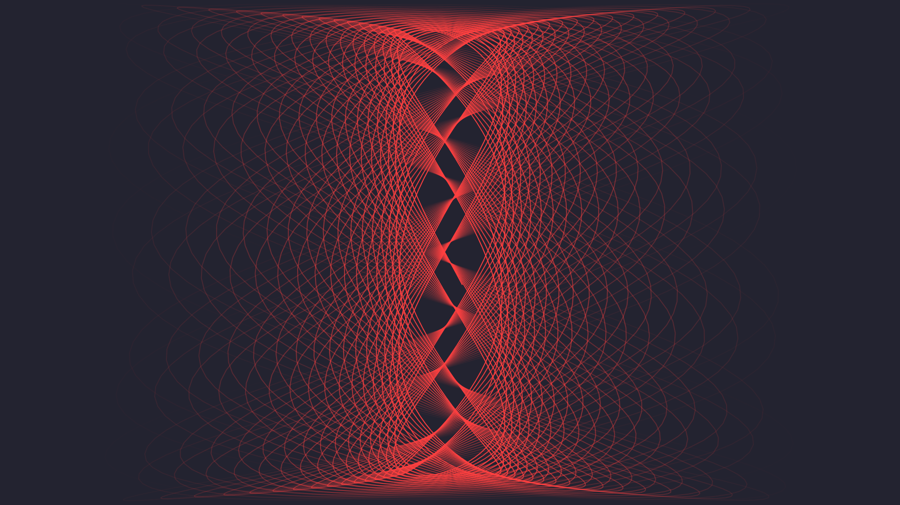
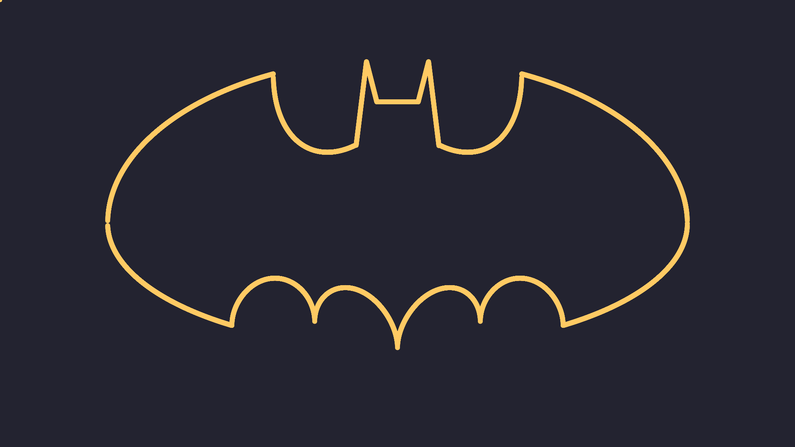
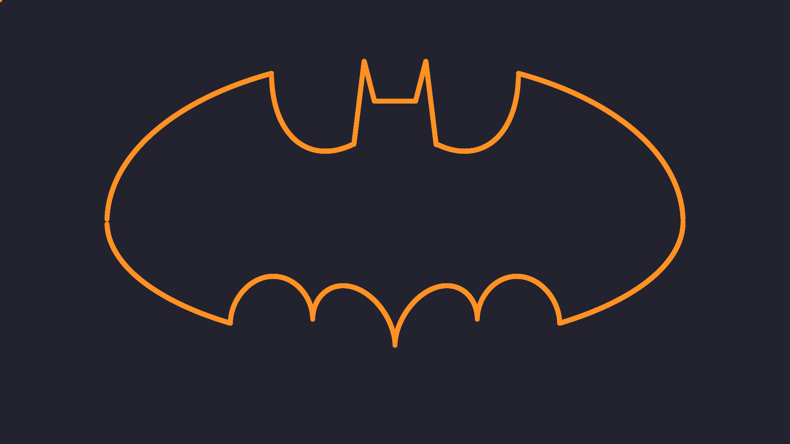
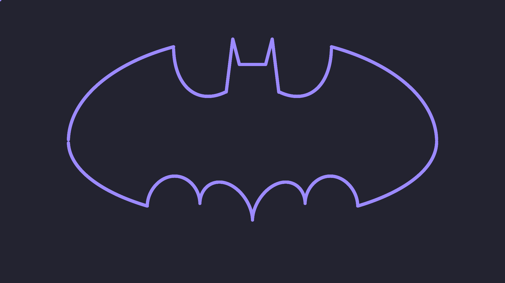
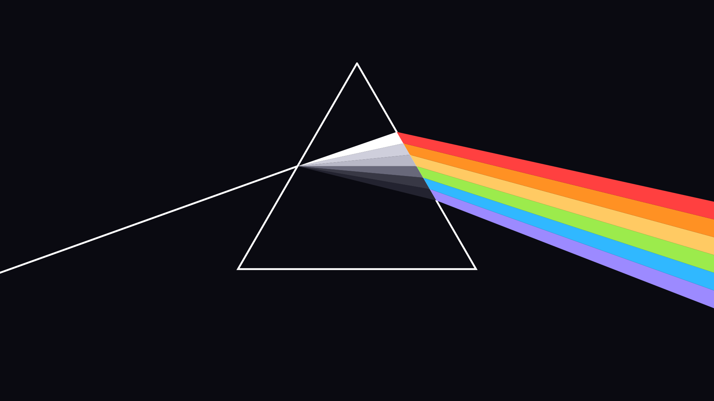

# Wallpaper generator

Generate random wallpapers from mathematical functions using a color palette (like
`~/.Xresources`).

Add your own generators in `wp-gen.lua`.

#### Harmonograph

</img> 
</img> 
</img> 
</img> 
</img> 
</img> 

#### Lines

</img> 
</img> 
</img> 

#### Batman Equation (because why not?)

</img> 
</img> 
</img> 

#### Pink Floyd

</img> 

## Development

The project provides a [nix-shell]() with all necesary dependencies and some
helpers ready.


```bash
# Enter nix-shell
user@host: nix-shell

# Build the project
[nix-shell:~/path] build
```

There is also a helper function defined, that will allow you to live-preview the
generated image. It will run the script on each save and show the image
fullscreen.

```bash
# Enter nix-shell
user@host: nix-shell

# Preview a generated image
[nix-shell:~/path] preview generator-homograph.png
```
